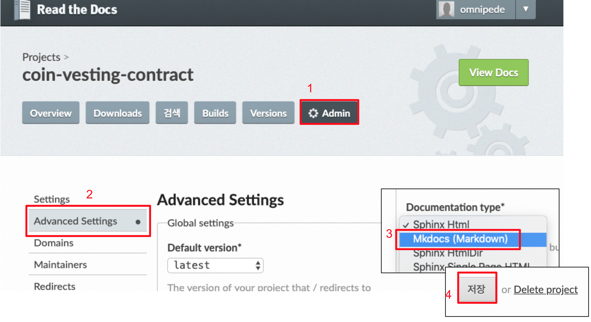

Getting started
================
Read the docs와 github repository를 연동하는 방법에 대해 알아봅니다.
<br>

- 연동하고자 하는 github repository에 ``` docs ``` 폴더와 ``` mkdocs.yml ``` 파일을 생성합니다.

- docs 폴더에 문서화하고자 하는 *.md 파일들을 넣어줍니다. (```README.md``` 또는 ```index.md``` 파일 둘 중 하나는 반드시 있어야 합니다.) 

- ```mkdocs.yml``` 파일은 다음과 같이 작성합니다.
````````````
site_name: Metadium Wiki
theme: readthedocs
````````````
- 위 수정사항들을 commit 하고 push 합니다.

- <https://readthedocs.org/> 으로 이동한 뒤 github 계정으로 로그인합니다.

- 우측 상단의 배지를 클릭하여 ```My Projects``` 탭으로 이동합니다.

- ```import project```를 클릭하면 본인의 모든 github repository 목록이 나옵니다. <br>
   앞서 ```docs``` 폴더와 ```mkdocs.yml``` 파일을 생성했던 repository를 선택합니다.
   


- Project의 ```Admin``` -> ```Advanced Settings``` 탭에서 ```Document type```을 Mkdocs (Markdown) 으로 변경하고 최하단의 ```저장``` 버튼을 클릭합니다.


- Project의 ```Overview``` 탭에서  ```Build version ``` 버튼을 눌러 빌드합니다. <br>
빌드가 완료되면, ```View Docs``` 버튼을 눌러 결과를 확인할 수 있습니다.


- 이후 github repository가 commit 될 때마다 Read the docs가 자동으로 빌드 해줍니다.
